# Ex.06 Restaurant Website
## Date:

## AIM:
To develop a static Restaurant website to display the food items and services provided by them.

## DESIGN STEPS:

### Step 1:
Requirement collection.

### Step 2:
Creating the layout using HTML and CSS.

### Step 3:
Updating the sample content.

### Step 4:
Choose the appropriate style and color scheme.

### Step 5:
Validate the layout in various browsers.

### Step 6:
Validate the HTML code.

### Step 7:
Publish the website in the given URL.

## PROGRAM:
```
<!DOCTYPE html>
<html>
<head>
    <title>Usagi’s Café</title>
    <link rel="stylesheet" href="style.css">
</head>
<body>

<header>
    <h1>Usagi’s Café 🐰</h1>
    <p>Soft desserts & gentle moments</p>
</header>

<nav>
    <a href="#desserts">Desserts</a>
    <a href="#friday">Friday Specials</a>
    <a href="#christmas">Christmas Specials</a>
    <a href="#visit">Visit</a>
</nav>

<!-- OUR DESSERTS -->
<section id="desserts">
    <h2>Our Desserts 🍰</h2>

    <div class="items">
        <div class="item">
            
            <p>Cat Bear Donut</p>
        </div>

        <div class="item">
            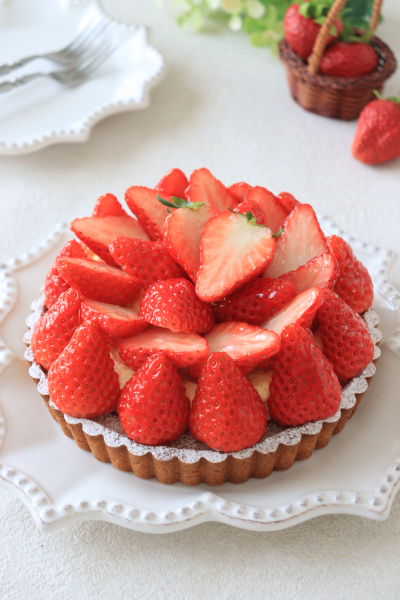
            <p>Strawberry Tart</p>
        </div>

        <div class="item">
            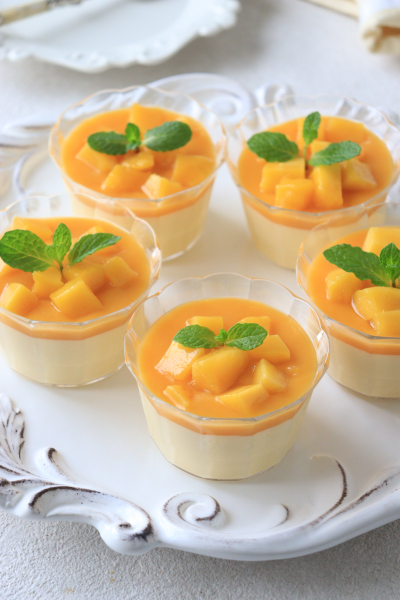
            <p>Mango Pudding</p>
        </div>

        <div class="item">
            
            <p>Gluten Free Ice Parfait</p>
        </div>

        <div class="item">
            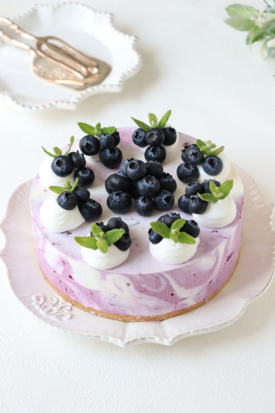
            <p>Blueberry Cheesecake</p>
        </div>

        <div class="item">
            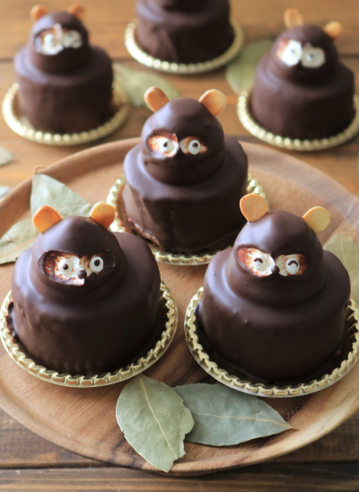
            <p>Chocolate Mousse</p>
        </div>

        <div class="item">
            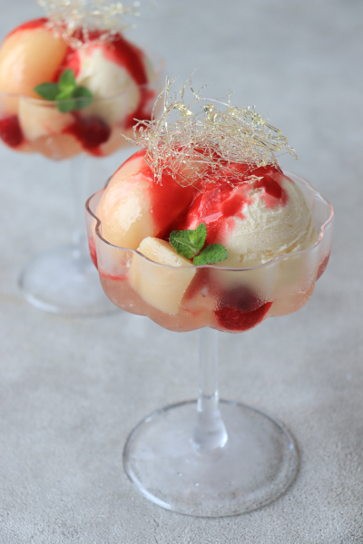
            <p>Peach Melba</p>
        </div>

        <div class="item">
            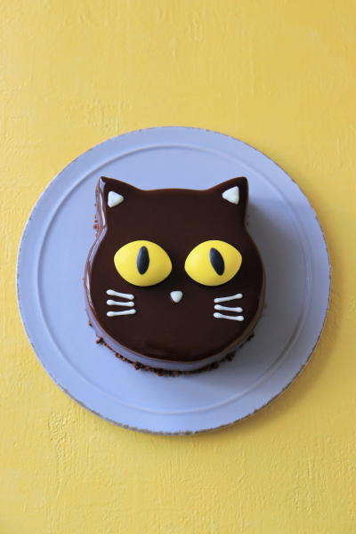
            <p>Black cat cake</p>
        </div>

        <div class="item">
            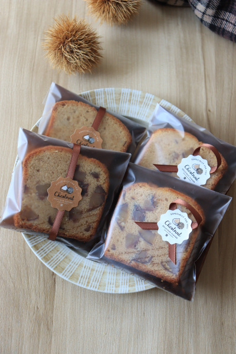
            <p>Chestnut pound cake wrapping</p>
        </div>

        <div class="item">
            
            <p>Sweet potato Mont Blanc</p>
        </div>

    </div>
</section>

<!-- FRIDAY SPECIALS -->
<section id="friday">
    <h2>Friday Specials 🌸</h2>

    <div class="items">
        <div class="item">
            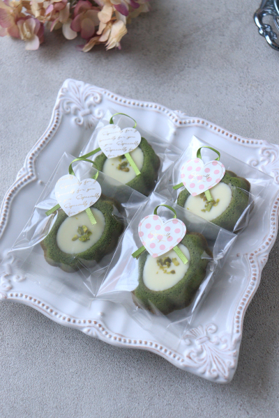
            <p>Matcha Tigre Wrapping</p>
        </div>

        <div class="item">
            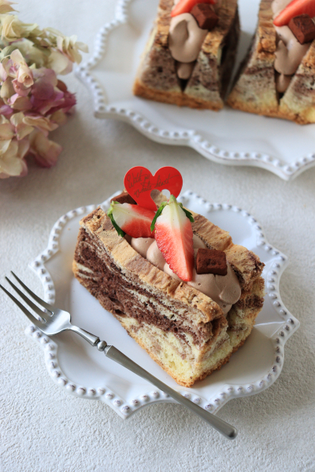
            <p>Tanuki Cake</p>
        </div>

        <div class="item">
            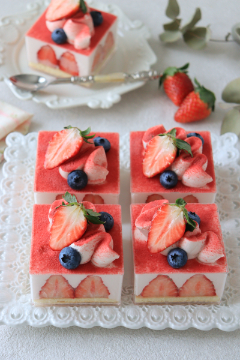
            <p>Strawberry Canelé</p>
        </div>
    </div>
</section>

<!-- CHRISTMAS SPECIALS -->
<section id="christmas">
    <h2>Christmas Specials 🎄</h2>

    <div class="items">
        <div class="item">
            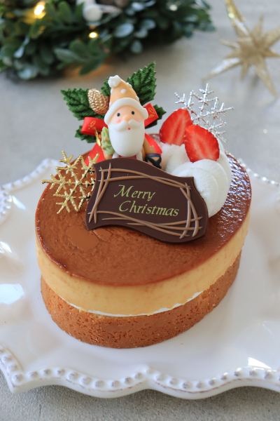
            <p>Christmas Strawberry Cake</p>
        </div>

        <div class="item">
            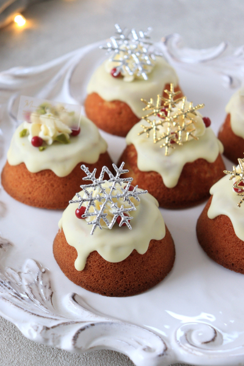
            <p>Gingerbread Dessert</p>
        </div>

        <div class="item">
            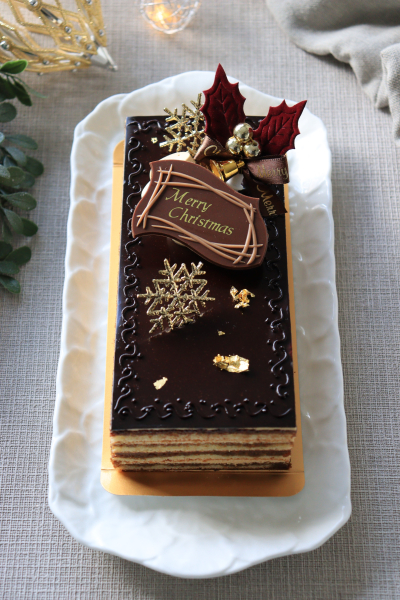
            <p>Chocolate Yule Log</p>
        </div>
    </div>
</section>

<!-- VISIT -->
<section id="visit">
    <h2>Visit Us 🐰</h2>
    <p>📍<p>📍 Arumbakkam, Chennai, Tamil Nadu, India</p>
</p>
    <p>🕒 11:00 AM – 8:00 PM</p>
</section>

<footer>
    <p>© 2025 Usagi’s Café</p>
</footer>

</body>
</html>

```

## OUTPUT:


## RESULT:
The program for designing software company website using HTML and CSS is completed successfully.
